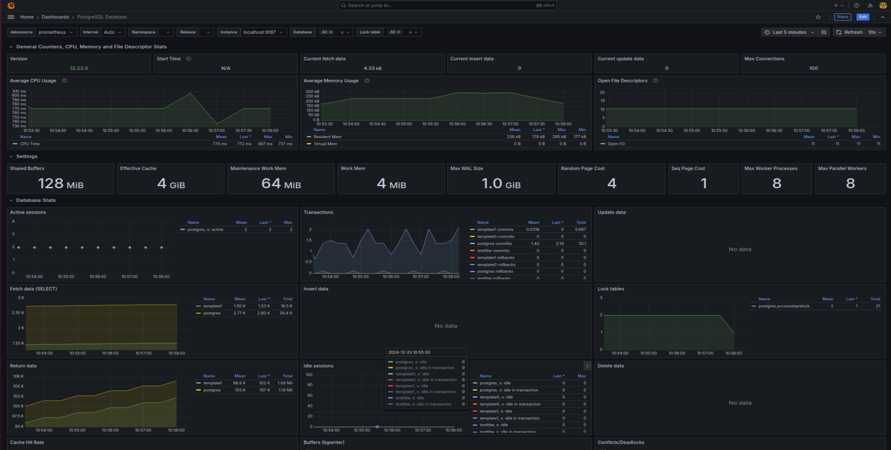
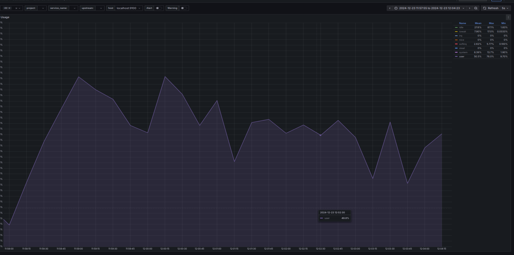
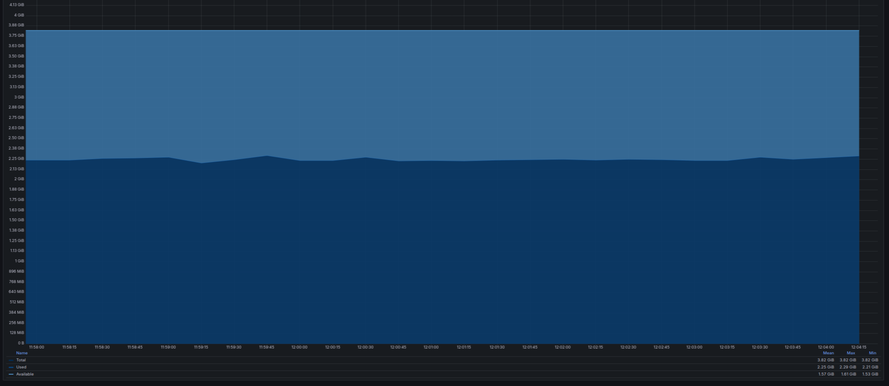
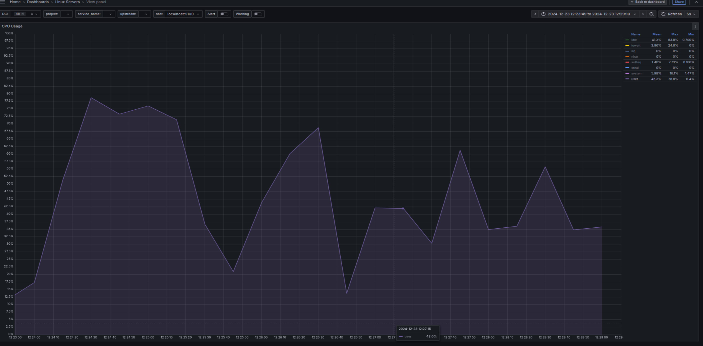
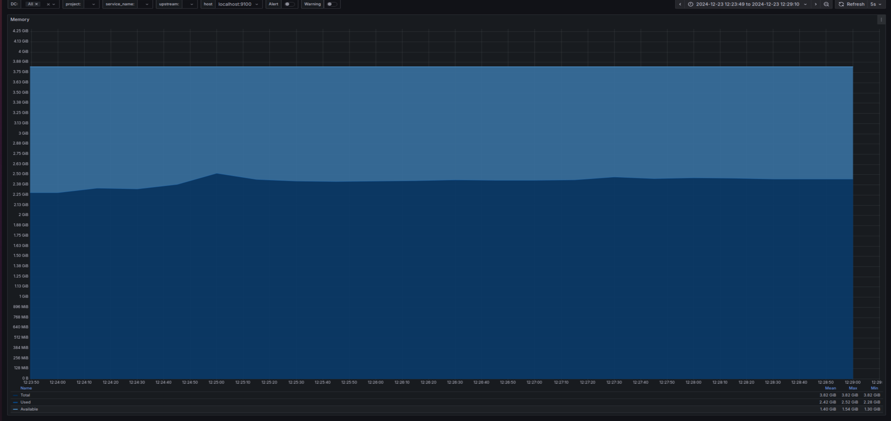
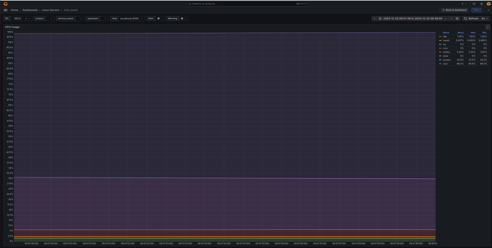

# BEGIN
### развернуть виртуальную машину любым удобным способом
### поставить на неё PostgreSQL 15 любым способом
### для мониторинга Postgresql, установил Prometheus, Grafana и PostgresExporter


### настроить кластер PostgreSQL 15 на максимальную производительность не обращая внимание на возможные проблемы с надежностью в случае аварийной перезагрузки виртуальной машины
### Начальные настройки у нас такие
```sql
postgres=# show work_mem ;
 work_mem
----------
 4MB
(1 row)

postgres=# show effective_cache_size ;
 effective_cache_size
----------------------
 4GB
(1 row)

postgres=# show shared_buffers ;
 shared_buffers
----------------
 128MB
(1 row)

postgres=# show max_connections ;
 max_connections
-----------------
 100
(1 row)

postgres=# show maintenance_work_mem ;
 maintenance_work_mem
----------------------
 64MB
(1 row)

postgres=# show wal_buffers ;
 wal_buffers
-------------
 4MB
(1 row)

postgres=# show max_wal_size ;
 max_wal_size
--------------
 1GB
(1 row)

postgres=# show checkpoint_timeout ;
 checkpoint_timeout
--------------------
 5min
(1 row)

```
### запустил pgbench и получил вот такие результаты
```sql
postgres@user-VirtualBox:~$ pgbench -j 2 -P 30 -T 300
starting vacuum...end.
progress: 30.0 s, 753.2 tps, lat 1.327 ms stddev 1.035
progress: 60.0 s, 593.9 tps, lat 1.683 ms stddev 1.633
progress: 90.0 s, 607.0 tps, lat 1.646 ms stddev 1.403
progress: 120.0 s, 650.1 tps, lat 1.538 ms stddev 1.520
progress: 150.0 s, 492.7 tps, lat 2.029 ms stddev 2.422
progress: 180.0 s, 578.9 tps, lat 1.727 ms stddev 1.706
progress: 210.0 s, 668.4 tps, lat 1.496 ms stddev 1.509
progress: 240.0 s, 577.3 tps, lat 1.732 ms stddev 1.661
progress: 270.0 s, 680.0 tps, lat 1.470 ms stddev 1.705
progress: 300.0 s, 660.9 tps, lat 1.513 ms stddev 1.297
transaction type: <builtin: TPC-B (sort of)>
scaling factor: 1
query mode: simple
number of clients: 1
number of threads: 1
duration: 300 s
number of transactions actually processed: 187877
latency average = 1.596 ms
latency stddev = 1.601 ms
tps = 626.256249 (including connections establishing)
tps = 626.260448 (excluding connections establishing)
```

### посмотрим утилизацию ресурсов
### CPU

### CPU был загружен наполовину, местами нагрузка доходила до 76% , что является нормой
### 
### Memory

### Память используется примерно 2.29GiB из 3.82GiB


### в конфигураторе pgconfig.org определил оптимальные настройки 
### попробуем профиль General web addlication
### и настроим только память
```sql
# Memory Configuration
shared_buffers = 1GB
effective_cache_size = 3GB
work_mem = 10MB
maintenance_work_mem = 205MB
```
### оптимизатор увеличил shared_buffers work_mem maintenance_work_mem и уменьшил effective_cache_size
```sql
postgres@user-VirtualBox:~$ pgbench -j 2 -P 30 -T 300
starting vacuum...end.
progress: 30.0 s, 900.6 tps, lat 1.110 ms stddev 0.581
progress: 60.0 s, 866.4 tps, lat 1.154 ms stddev 0.573
progress: 90.0 s, 897.0 tps, lat 1.115 ms stddev 0.581
progress: 120.0 s, 881.2 tps, lat 1.134 ms stddev 0.753
progress: 150.0 s, 845.7 tps, lat 1.183 ms stddev 1.138
progress: 180.0 s, 886.8 tps, lat 1.127 ms stddev 0.653
progress: 210.0 s, 875.3 tps, lat 1.142 ms stddev 0.807
progress: 240.0 s, 712.3 tps, lat 1.404 ms stddev 1.140
progress: 270.0 s, 591.8 tps, lat 1.689 ms stddev 1.441
progress: 300.0 s, 601.8 tps, lat 1.661 ms stddev 1.586
transaction type: <builtin: TPC-B (sort of)>
scaling factor: 1
query mode: simple
number of clients: 1
number of threads: 1
duration: 300 s
number of transactions actually processed: 241771
latency average = 1.241 ms
latency stddev = 0.959 ms
tps = 805.901087 (including connections establishing)
tps = 805.906595 (excluding connections establishing)
```
### Количество TPS увеличилось на 22%
### Задержка соответтственно уменьшилась тоже на 22%
### Это хороший результат тюнинга
### Посмотрим утилизацию железа
### CPU

### здесь можно заметить, что процессор стал работать немного меньше и дольше "отдыхать"
### это связано с тем, что мы оптимизировали память, и часть нагрузки перешла в нее и процессы стали меньше задействовать процессор
### Memory (RAM)

### и, дествительно памяти стало использоваться немного больше
### а теперь попробуем применить все настройки, которые рекомендует оптимизатор, а именно
```sql
# Memory Configuration
shared_buffers = 1GB
effective_cache_size = 3GB
work_mem = 10MB
maintenance_work_mem = 205MB

# Checkpoint Related Configuration
min_wal_size = 2GB
max_wal_size = 3GB
checkpoint_completion_target = 0.9
wal_buffers = -1

# Network Related Configuration
listen_addresses = '*'
max_connections = 100

# Storage Configuration
random_page_cost = 1.1
effective_io_concurrency = 200

# Worker Processes Configuration
max_worker_processes = 8
max_parallel_workers_per_gather = 2
max_parallel_workers = 2

# Logging configuration for pgbadger
logging_collector = on
log_checkpoints = on
log_connections = on
log_disconnections = on
log_lock_waits = on
log_temp_files = 0
lc_messages = 'C'

# Adjust the minimum time to collect the data
log_min_duration_statement = '10s'
log_autovacuum_min_duration = 0

# CSV Configuration
log_destination = 'csvlog'
```

### результаты ухудшились
```sql

postgres@user-VirtualBox:~$ vim /etc/postgresql/12/main/postgresql.conf
postgres@user-VirtualBox:~$ exit
logout
root@user-VirtualBox:~# pg_ctlcluster 12 main restart
root@user-VirtualBox:~# su - postgres
postgres@user-VirtualBox:~$ pgbench -j 2 -P 30 -T 300
starting vacuum...end.
progress: 30.0 s, 564.7 tps, lat 1.770 ms stddev 1.518
progress: 60.0 s, 570.1 tps, lat 1.754 ms stddev 1.556
progress: 90.0 s, 581.5 tps, lat 1.719 ms stddev 1.516
progress: 120.0 s, 687.4 tps, lat 1.454 ms stddev 1.058
progress: 150.0 s, 676.7 tps, lat 1.477 ms stddev 1.297
progress: 180.0 s, 608.2 tps, lat 1.643 ms stddev 2.028
progress: 210.0 s, 671.6 tps, lat 1.489 ms stddev 1.428
progress: 240.0 s, 585.8 tps, lat 1.707 ms stddev 1.514
progress: 270.0 s, 555.0 tps, lat 1.801 ms stddev 1.631
progress: 300.0 s, 552.9 tps, lat 1.808 ms stddev 1.868
transaction type: <builtin: TPC-B (sort of)>
scaling factor: 1
query mode: simple
number of clients: 1
number of threads: 1
duration: 300 s
number of transactions actually processed: 181619
latency average = 1.651 ms
latency stddev = 1.556 ms
tps = 605.396157 (including connections establishing)
tps = 605.401937 (excluding connections establishing)
```
### давайте разберемся включим только первые две секции, остальные закомментируем
```sql
# Memory Configuration
shared_buffers = 1GB
effective_cache_size = 3GB
work_mem = 10MB
maintenance_work_mem = 205MB

# Checkpoint Related Configuration
min_wal_size = 2GB
max_wal_size = 3GB
checkpoint_completion_target = 0.9
wal_buffers = -1
```
```sql
postgres@user-VirtualBox:~$ pgbench -j 2 -P 30 -T 300
starting vacuum...end.
progress: 30.0 s, 633.2 tps, lat 1.579 ms stddev 1.230
progress: 60.0 s, 617.9 tps, lat 1.618 ms stddev 1.383
progress: 90.0 s, 618.0 tps, lat 1.618 ms stddev 1.392
progress: 120.0 s, 555.9 tps, lat 1.798 ms stddev 1.700
progress: 150.0 s, 663.0 tps, lat 1.508 ms stddev 1.277
progress: 180.0 s, 624.4 tps, lat 1.601 ms stddev 1.783
progress: 210.0 s, 521.4 tps, lat 1.917 ms stddev 1.727
progress: 240.0 s, 505.0 tps, lat 1.980 ms stddev 1.295
progress: 270.0 s, 493.6 tps, lat 2.025 ms stddev 1.541
progress: 300.0 s, 488.2 tps, lat 2.048 ms stddev 2.067
transaction type: <builtin: TPC-B (sort of)>
scaling factor: 1
query mode: simple
number of clients: 1
number of threads: 1
duration: 300 s
number of transactions actually processed: 171618
latency average = 1.748 ms
latency stddev = 1.558 ms
tps = 572.057612 (including connections establishing)
tps = 572.061609 (excluding connections establishing)

```
### убрал все, оставил добавление блока Memory

```sql
postgres@user-VirtualBox:~$ pgbench -j 2 -P 30 -T 300
starting vacuum...end.
progress: 30.0 s, 743.2 tps, lat 1.345 ms stddev 0.862
progress: 60.0 s, 686.8 tps, lat 1.456 ms stddev 0.967
progress: 90.0 s, 766.6 tps, lat 1.304 ms stddev 0.967
progress: 120.0 s, 804.4 tps, lat 1.243 ms stddev 0.841
progress: 150.0 s, 787.4 tps, lat 1.270 ms stddev 1.057
progress: 180.0 s, 737.7 tps, lat 1.355 ms stddev 1.190
progress: 210.0 s, 745.7 tps, lat 1.341 ms stddev 0.974
progress: 240.0 s, 776.3 tps, lat 1.288 ms stddev 0.914
progress: 270.0 s, 724.4 tps, lat 1.380 ms stddev 1.080
progress: 300.0 s, 786.0 tps, lat 1.272 ms stddev 0.991
transaction type: <builtin: TPC-B (sort of)>
scaling factor: 1
query mode: simple
number of clients: 1
number of threads: 1
duration: 300 s
number of transactions actually processed: 226751
latency average = 1.323 ms
latency stddev = 0.990 ms
tps = 755.834916 (including connections establishing)
tps = 755.843826 (excluding connections establishing)

```
### результаты лучше, но не достигнуты эталонных, полученных в предыдущих тестах
### попробую перезагрузить виртуалку
```sql
postgres@user-VirtualBox:~$ pgbench -j 2 -P 30 -T 300
starting vacuum...end.
progress: 30.0 s, 909.7 tps, lat 1.099 ms stddev 0.655
progress: 60.0 s, 895.4 tps, lat 1.116 ms stddev 0.731
progress: 90.0 s, 746.1 tps, lat 1.340 ms stddev 0.551
progress: 120.0 s, 738.7 tps, lat 1.353 ms stddev 0.830
progress: 150.0 s, 594.8 tps, lat 1.681 ms stddev 1.654
progress: 180.0 s, 553.4 tps, lat 1.806 ms stddev 1.669
progress: 210.0 s, 700.4 tps, lat 1.427 ms stddev 1.126
progress: 240.0 s, 567.3 tps, lat 1.762 ms stddev 1.257
progress: 270.0 s, 508.3 tps, lat 1.967 ms stddev 1.458
progress: 300.0 s, 541.8 tps, lat 1.845 ms stddev 1.367
transaction type: <builtin: TPC-B (sort of)>
scaling factor: 1
query mode: simple
number of clients: 1
number of threads: 1
duration: 300 s
number of transactions actually processed: 202686
latency average = 1.480 ms
latency stddev = 1.170 ms
tps = 675.603460 (including connections establishing)
tps = 675.608599 (excluding connections establishing)
```
### Резулькаты все равно остались хуже первоначальных эталонных
### Теперь попробуем использовать конфигурацию для OLTP нагрузки 
### Она отличается увеличенным work_mem с 10MB до 14MB
```sql
# Memory Configuration
shared_buffers = 1GB
effective_cache_size = 3GB
work_mem = 14MB
maintenance_work_mem = 205MB

# Checkpoint Related Configuration
min_wal_size = 2GB
max_wal_size = 3GB
checkpoint_completion_target = 0.9
wal_buffers = -1

# Network Related Configuration
listen_addresses = '*'
max_connections = 100

# Storage Configuration
random_page_cost = 1.1
effective_io_concurrency = 200

# Worker Processes Configuration
max_worker_processes = 8
max_parallel_workers_per_gather = 2
max_parallel_workers = 2

# Logging configuration for pgbadger
logging_collector = on
log_checkpoints = on
log_connections = on
log_disconnections = on
log_lock_waits = on
log_temp_files = 0
lc_messages = 'C'

# Adjust the minimum time to collect the data
log_min_duration_statement = '10s'
log_autovacuum_min_duration = 0

# CSV Configuration
log_destination = 'csvlog'

```
### результаты
```sql
root@user-VirtualBox:~# su - postgres
postgres@user-VirtualBox:~$ pgbench -j 2 -P 30 -T 300
starting vacuum...end.
progress: 30.0 s, 874.0 tps, lat 1.144 ms stddev 0.724
progress: 60.0 s, 704.8 tps, lat 1.418 ms stddev 0.990
progress: 90.0 s, 652.3 tps, lat 1.533 ms stddev 0.986
progress: 120.0 s, 648.4 tps, lat 1.542 ms stddev 1.043
progress: 150.0 s, 613.2 tps, lat 1.630 ms stddev 1.018
progress: 180.0 s, 591.6 tps, lat 1.690 ms stddev 1.371
progress: 210.0 s, 584.9 tps, lat 1.709 ms stddev 1.104
progress: 240.0 s, 596.9 tps, lat 1.675 ms stddev 1.110
progress: 270.0 s, 568.5 tps, lat 1.757 ms stddev 1.022
progress: 300.0 s, 600.2 tps, lat 1.667 ms stddev 1.126
transaction type: <builtin: TPC-B (sort of)>
scaling factor: 1
query mode: simple
number of clients: 1
number of threads: 1
duration: 300 s
number of transactions actually processed: 193040
latency average = 1.554 ms
latency stddev = 1.063 ms
tps = 643.451103 (including connections establishing)
tps = 643.461027 (excluding connections establishing)
```
```sql
postgres@user-VirtualBox:~$ pgbench  -j 2 -P 30 -T 300 -c 90
starting vacuum...end.
progress: 30.0 s, 773.8 tps, lat 115.314 ms stddev 136.459
progress: 60.0 s, 746.9 tps, lat 120.524 ms stddev 139.662
progress: 90.0 s, 605.3 tps, lat 148.192 ms stddev 163.169
progress: 120.0 s, 672.6 tps, lat 134.220 ms stddev 155.366
progress: 150.0 s, 754.2 tps, lat 119.404 ms stddev 129.209
progress: 180.0 s, 890.6 tps, lat 101.010 ms stddev 112.379
progress: 210.0 s, 898.3 tps, lat 99.790 ms stddev 109.681
progress: 240.0 s, 445.9 tps, lat 201.161 ms stddev 236.920
progress: 270.0 s, 519.5 tps, lat 173.426 ms stddev 192.265
progress: 300.0 s, 539.1 tps, lat 167.378 ms stddev 196.882
transaction type: <builtin: TPC-B (sort of)>
scaling factor: 1
query mode: simple
number of clients: 90
number of threads: 2
duration: 300 s
number of transactions actually processed: 205476
latency average = 131.457 ms
latency stddev = 156.482 ms
tps = 683.667618 (including connections establishing)
tps = 683.675497 (excluding connections establishing)

```

### попробую увеличить количество потоков до 10(хотя это не рекомендуется, т.к. на виртуалке всего 2 vCPU)
### и выставлю в 90 число имитируемых клиентов, то есть число одновременных сеансов базы данных. Значение по умолчанию — 1.
```sql

postgres@user-VirtualBox:~$ pgbench  -j 10 -P 30 -T 300 -c 90
starting vacuum...end.
progress: 30.0 s, 543.5 tps, lat 164.156 ms stddev 193.578
progress: 60.0 s, 537.8 tps, lat 166.610 ms stddev 196.598
progress: 90.0 s, 583.0 tps, lat 154.153 ms stddev 178.186
progress: 120.0 s, 580.2 tps, lat 155.525 ms stddev 177.967
progress: 150.0 s, 471.1 tps, lat 190.889 ms stddev 200.021
progress: 180.0 s, 530.4 tps, lat 169.992 ms stddev 195.639
progress: 210.0 s, 554.4 tps, lat 162.409 ms stddev 181.286
progress: 240.0 s, 587.4 tps, lat 152.905 ms stddev 182.416
progress: 270.0 s, 544.7 tps, lat 164.973 ms stddev 180.504
progress: 300.0 s, 560.7 tps, lat 160.122 ms stddev 189.369
transaction type: <builtin: TPC-B (sort of)>
scaling factor: 1
query mode: simple
number of clients: 90
number of threads: 10
duration: 300 s
number of transactions actually processed: 164885
latency average = 163.812 ms
latency stddev = 188.079 ms
tps = 548.558684 (including connections establishing)
tps = 548.593868 (excluding connections establishing)
```
### результаты стали еще хуже, возможно из-за того, что я ограничил число иммитируемых клиентов (так бы тест использовал все возможные) возможно из-за увеличения количества возможных потоков
### и сама ВМ заметно просела в скорости

### на графике можно увидеть, что по CPU утилизация стала 100% т.е. все мощности процессоров были израсходованы
### оставим тогда в pgbench два потока 
### попробуем использовать нагрузку DWH- но это скорее будет OLAP нагрузка, чем OLTP, а pgbench специализируется по транзакционным нагрузкам, проверим гипотезу и возьмем настройки из pgconfig.org для DWH
### относительно OLTP нагрузки, мы увеличили work_mem на 4MB остальные настройки такие же как и у OLTP
### work_mem используется для сортировок, построения hash таблиц. Это позволяет выполнять данные операции в памяти, что гораздо быстрее обращения к диску. В рамках одного запроса данный параметр может быть использован множество раз. Если, например запрос содержит пять операций сортировки, то память, которая потребуется для его выполнения уже как минимум work_mem*5 Т.к. скорее всего на сервере я не один и сессий много, то каждаяиз них может использовать этот параметр по нескольку раз, поэтому не рекомендуется делать его слишком большим. Можно выставить небольшое значение для глобального параметра в конфиге и потом, в случае сложных запросов, менять этот параметр локально (для текущей сессии). Здесь мы увеличили этот параметр, т.к. OLAP нагрузка не подразумевает слишком большого количества подключений/пользователей как OLTP нагрузка, и т.к. каждая сессия будет "отъедать" work_mem. И в OLAP нагрузке может быть большое количество  операций сортировок, по этой причине рекомендуется work_mem немного увеличить
```sql
# Memory Configuration
shared_buffers = 1GB
effective_cache_size = 3GB
work_mem = 20MB
maintenance_work_mem = 205MB

# Checkpoint Related Configuration
min_wal_size = 2GB
max_wal_size = 3GB
checkpoint_completion_target = 0.9
wal_buffers = -1

# Network Related Configuration
listen_addresses = '*'
max_connections = 100

# Storage Configuration
random_page_cost = 1.1
effective_io_concurrency = 200

# Worker Processes Configuration
max_worker_processes = 8
max_parallel_workers_per_gather = 2
max_parallel_workers = 2

# Logging configuration for pgbadger
logging_collector = on
log_checkpoints = on
log_connections = on
log_disconnections = on
log_lock_waits = on
log_temp_files = 0
lc_messages = 'C'

# Adjust the minimum time to collect the data
log_min_duration_statement = '10s'
log_autovacuum_min_duration = 0

# CSV Configuration
log_destination = 'csvlog'
```
### и получилось вот что:
```sql
root@user-VirtualBox:~# pg_ctlcluster 12 main restart
root@user-VirtualBox:~# su - postgres
postgres@user-VirtualBox:~$ pgbench  -j 10 -P 30 -T 300
starting vacuum...end.
progress: 30.0 s, 750.2 tps, lat 1.332 ms stddev 0.932
progress: 60.0 s, 858.2 tps, lat 1.165 ms stddev 0.748
progress: 90.0 s, 920.5 tps, lat 1.086 ms stddev 0.622
progress: 120.0 s, 831.5 tps, lat 1.202 ms stddev 1.293
progress: 150.0 s, 827.2 tps, lat 1.209 ms stddev 1.320
progress: 180.0 s, 908.4 tps, lat 1.101 ms stddev 0.665
progress: 210.0 s, 870.8 tps, lat 1.148 ms stddev 0.770
progress: 240.0 s, 751.5 tps, lat 1.330 ms stddev 0.921
progress: 270.0 s, 885.8 tps, lat 1.129 ms stddev 0.829
progress: 300.0 s, 877.8 tps, lat 1.139 ms stddev 0.771
transaction type: <builtin: TPC-B (sort of)>
scaling factor: 1
query mode: simple
number of clients: 1
number of threads: 1
duration: 300 s
number of transactions actually processed: 254459
latency average = 1.179 ms
latency stddev = 0.912 ms
tps = 848.195516 (including connections establishing)
tps = 848.201587 (excluding connections establishing)
```


