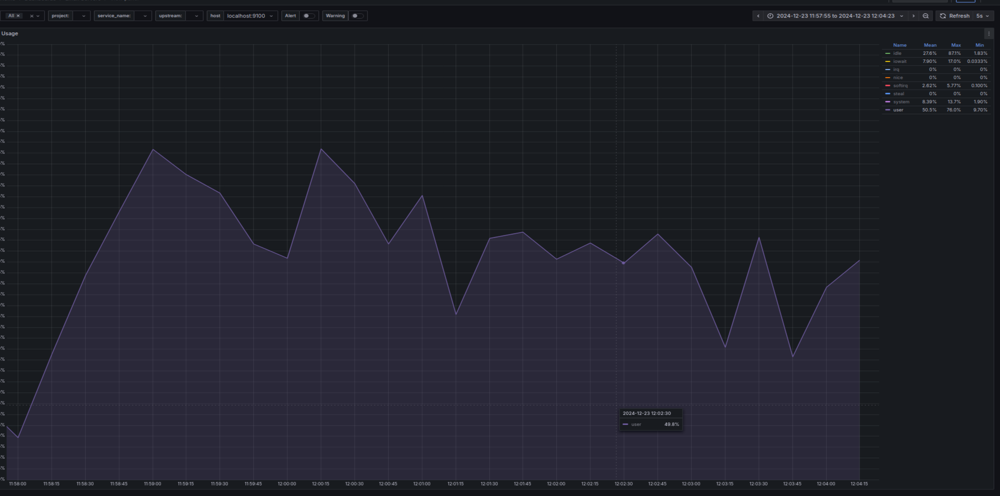
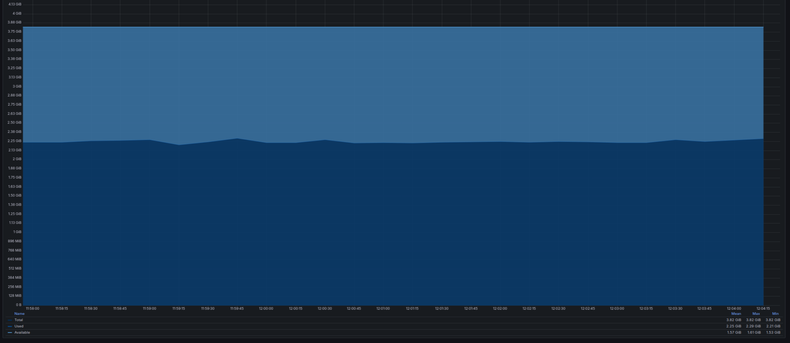
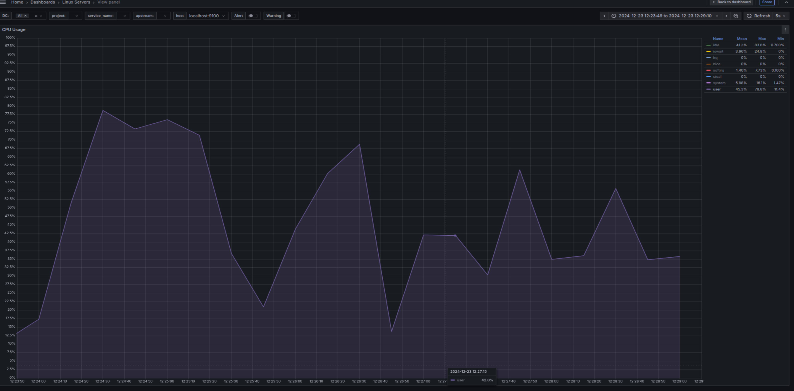

# BEGIN
### развернуть виртуальную машину любым удобным способом
### поставить на неё PostgreSQL 15 любым способом
### для мониторинга Postgresql, установил Prometheus, Grafana и PostgresExporter


### настроить кластер PostgreSQL 15 на максимальную производительность не обращая внимание на возможные проблемы с надежностью в случае аварийной перезагрузки виртуальной машины
### Начальные настройки у нас такие
```sql
postgres=# show work_mem ;
 work_mem
----------
 4MB
(1 row)

postgres=# show effective_cache_size ;
 effective_cache_size
----------------------
 4GB
(1 row)

postgres=# show shared_buffers ;
 shared_buffers
----------------
 128MB
(1 row)

postgres=# show max_connections ;
 max_connections
-----------------
 100
(1 row)

postgres=# show maintenance_work_mem ;
 maintenance_work_mem
----------------------
 64MB
(1 row)

postgres=# show wal_buffers ;
 wal_buffers
-------------
 4MB
(1 row)

postgres=# show max_wal_size ;
 max_wal_size
--------------
 1GB
(1 row)

postgres=# show checkpoint_timeout ;
 checkpoint_timeout
--------------------
 5min
(1 row)

```
### запустил pgbench и получил вот такие результаты
```sql
postgres@user-VirtualBox:~$ pgbench -j 2 -P 30 -T 300
starting vacuum...end.
progress: 30.0 s, 753.2 tps, lat 1.327 ms stddev 1.035
progress: 60.0 s, 593.9 tps, lat 1.683 ms stddev 1.633
progress: 90.0 s, 607.0 tps, lat 1.646 ms stddev 1.403
progress: 120.0 s, 650.1 tps, lat 1.538 ms stddev 1.520
progress: 150.0 s, 492.7 tps, lat 2.029 ms stddev 2.422
progress: 180.0 s, 578.9 tps, lat 1.727 ms stddev 1.706
progress: 210.0 s, 668.4 tps, lat 1.496 ms stddev 1.509
progress: 240.0 s, 577.3 tps, lat 1.732 ms stddev 1.661
progress: 270.0 s, 680.0 tps, lat 1.470 ms stddev 1.705
progress: 300.0 s, 660.9 tps, lat 1.513 ms stddev 1.297
transaction type: <builtin: TPC-B (sort of)>
scaling factor: 1
query mode: simple
number of clients: 1
number of threads: 1
duration: 300 s
number of transactions actually processed: 187877
latency average = 1.596 ms
latency stddev = 1.601 ms
tps = 626.256249 (including connections establishing)
tps = 626.260448 (excluding connections establishing)
```

### посмотрим утилизацию ресурсов
### CPU

### CPU был загружен наполовину, местами нагрузка доходила до 76% , что является нормой
### 
### Memory

### Память используется примерно 2.29GiB из 3.82GiB


### в конфигураторе pgconfig.org определил оптимальные настройки 
### попробуем профиль General web addlication
### и настроим только память
```sql
# Memory Configuration
shared_buffers = 1GB
effective_cache_size = 3GB
work_mem = 10MB
maintenance_work_mem = 205MB
```
### оптимизатор увеличил shared_buffers work_mem maintenance_work_mem и уменьшил effective_cache_size
```sql
postgres@user-VirtualBox:~$ pgbench -j 2 -P 30 -T 300
starting vacuum...end.
progress: 30.0 s, 900.6 tps, lat 1.110 ms stddev 0.581
progress: 60.0 s, 866.4 tps, lat 1.154 ms stddev 0.573
progress: 90.0 s, 897.0 tps, lat 1.115 ms stddev 0.581
progress: 120.0 s, 881.2 tps, lat 1.134 ms stddev 0.753
progress: 150.0 s, 845.7 tps, lat 1.183 ms stddev 1.138
progress: 180.0 s, 886.8 tps, lat 1.127 ms stddev 0.653
progress: 210.0 s, 875.3 tps, lat 1.142 ms stddev 0.807
progress: 240.0 s, 712.3 tps, lat 1.404 ms stddev 1.140
progress: 270.0 s, 591.8 tps, lat 1.689 ms stddev 1.441
progress: 300.0 s, 601.8 tps, lat 1.661 ms stddev 1.586
transaction type: <builtin: TPC-B (sort of)>
scaling factor: 1
query mode: simple
number of clients: 1
number of threads: 1
duration: 300 s
number of transactions actually processed: 241771
latency average = 1.241 ms
latency stddev = 0.959 ms
tps = 805.901087 (including connections establishing)
tps = 805.906595 (excluding connections establishing)
```
### Количество TPS увеличилось на 22%
### Задержка соответтственно уменьшилась тоже на 22%
### Это хороший результат тюнинга
### Посмотрим утилизацию железа
### CPU

