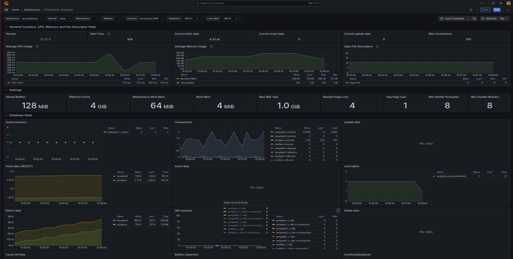

# BEGIN
### развернуть виртуальную машину любым удобным способом
### поставить на неё PostgreSQL 15 любым способом
### Для мониторинга Postgresql установил Prometheus, Grafana, PostgresExporter

### настроить кластер PostgreSQL 15 на максимальную производительность не обращая внимание на возможные проблемы с надежностью в случае аварийной перезагрузки виртуальной машины
