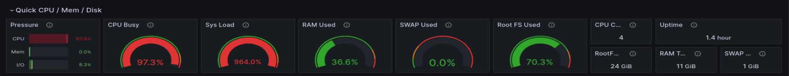

# Начало
#### развернуть виртуальную машину любым удобным способом
#### поставить на неё PostgreSQL 15 любым способом
#### настроить кластер PostgreSQL 15 на максимальную производительность не обращая внимание на возможные проблемы с надежностью в случае аварийной перезагрузки виртуальной машины
## Настройки параметров по умолчанию такие:
```sql
postgres=# show work_mem;
 work_mem
----------
 4MB
(1 row)
```
#### используется для сортировок, построения хэш таблиц. Это позволяет выполнять данные операции в памяти, что гораздо быстрее обращений к диску. В рамках одного запроса данный параметр может быть использован много раз. Если ваш запрос содержит пять операций сортировки, то память которая потребуется для его выполнения как минимум 5*work_mem.  Так как, скорее всего на сервере вы не одни и сессий много, то каждая из них может использовать этот параметр по многу  раз, поэтому не рекомендуется делать его слишком большим. Можно выставить небольшое значение в глобальном конфиге, а в сессиях локально его менять(в случае сложных запросов).
```sql
postgres=# show effective_cache_size ;
 effective_cache_size
----------------------
 4GB
(1 row)
```
#### служит подсказкой для планировщика, сколько ОП у него в запасе. Можно определить как shared_buffers + ОП системы, т.е. ОП, используемое самой ОС и сторонними приложениями. За счет данного параметра планировщик чаще может использовать индексы. Наиболее часто используемое значение 75% от общей на сервере.
```sql
postgres=# show shared_buffers ;
 shared_buffers
----------------
 128MB
(1 row)
```
#### используется для кэширования данных. По умолчанию значение низкое- для поддержания большого количества ОС. Начать стоит с его изменения. Согласно документации, рекомендуемое значение для этого параметра 25% от общей оперативной памяти на сервере. Postgresql использует два кэша. Свой shared_buffers и ОС. Редко значение больше чем 40% окажет влияние на производительность.
```sql
postgres=# show max_connections ;
 max_connections
-----------------
 100
(1 row)
```
#### максимальное количество соединений. Для изменения параметра придется перезапускать сервер. Если планируется использовать Postgresql как DWH то большого количества соединений не нужно. Данный параметр тесно связан с work_mem
```sql
postgres=# show maintenance_work_mem ;
 maintenance_work_mem
----------------------
 64MB
(1 row)
```
#### определяет максимальное количество ОП для операций VACUUM, CREATE INDEX, CREATE FOREGN KEY увеличение этого параметра позволит быстее выполнять эти операции. Не связано с work_mem , поэтому можно ставить в разы больше, чем work_mem
```sql
postgres=# show wal_buffers ;
 wal_buffers
-------------
 4MB
(1 row)
```
#### объем разделяемой памяти, которая будет использоваться для буфферизации данных wal, еще не записанных на диск. Если у вас большое количество одновременных подключений, то увеличение параметра улучшит производительность. По умолчанию -1 определяется автоматически, как 1/32 от shared_buffers, но не больше чем 16МБ. В ручную можно задавать большие значения. Но обычно не боьше 16МБ
```sql
postgres=# show checkpoint_timeout ;
 checkpoint_timeout
--------------------
 5min
(1 row)
```
#### чем реже происходит сбрасывание, тем дольше будет восстановление БД после сбоя. Значение по умолчанию 5 минут, рекомендуемое от 30 минут до часа.
```sql
postgres=# show max_wal_size ;
 max_wal_size
--------------
 1GB
(1 row)
```
#### Задаёт допустимое число параллельных операций ввода/вывода, которое говорит PostgreSQL о том, сколько операций ввода/вывода могут быть выполнены одновременно. Чем больше это число, тем больше операций ввода/вывода будет пытаться выполнить параллельно PostgreSQL в отдельном сеансе. Допустимые значения лежат в интервале от 1 до 1000, а нулевое значение отключает асинхронные запросы ввода/вывода. В настоящее время этот параметр влияет только на сканирование по битовой карте.
```sql
postgres=# show effective_io_concurrency ;
 effective_io_concurrency
--------------------------
 1
(1 row)
```
#### максимальный размер  до которого может возрастать wal между контрольными точками в wal. Значение по умолчанию 1ГБ. Увеличение этого параметра может привести к увеличению времени, которое понадобится для восстановления после сбоя. Но позволит реже выполнять операцию сбрасывания на диск. Так же сбрасывание может выполнится и при достижении нужного времени, определенного в параметре checkpoint_timeout
#### Найдем расположение конфиг файла через psql 
```sql
postgres=# show config_file ;
               config_file
-----------------------------------------
 /etc/postgresql/12/main/postgresql.conf

postgres=# select current_setting('config_file');
             current_setting
-----------------------------------------
 /etc/postgresql/12/main/postgresql.conf
(1 row)

```
#### запустим pgbench сначала с дефолтным конфигом
```sql
postgres@Ubuntu:~$ pgbench -c 50 -j 2 -P 10 -T 60
starting vacuum...end.
progress: 10.0 s, 1016.1 tps, lat 48.672 ms stddev 50.000
progress: 20.0 s, 722.7 tps, lat 69.077 ms stddev 78.785
progress: 30.0 s, 783.3 tps, lat 63.720 ms stddev 84.850
progress: 40.0 s, 987.6 tps, lat 50.691 ms stddev 53.640
progress: 50.0 s, 1052.8 tps, lat 47.532 ms stddev 48.866
progress: 60.0 s, 1067.2 tps, lat 46.823 ms stddev 50.160
transaction type: <builtin: TPC-B (sort of)>
scaling factor: 1
query mode: simple
number of clients: 50
number of threads: 2
duration: 60 s
number of transactions actually processed: 56347
latency average = 53.215 ms
latency stddev = 61.207 ms
tps = 937.638183 (including connections establishing)
tps = 937.678190 (excluding connections establishing)
```
#### теперь попробуем настроить сервер на максимальную производительность. Будем это делать с помощью pgconfig
#### General WEB Aplication
#### мы увеличили shared_buffers, work_mem, max_wal_size
#### уменьшили effective_cache_size
#### значение wal_buffers=-1 означает 1/32 от shared_buffers в нашем случае получилось 32МБ
* shared_buffers
  - мы увеличили, потому что он по умолчанию маленький. это сделано для увеличения совместимости с большим количеством систем, и так так в него читаются данные, для чтения, изменения и тд, то чем больше мы его сделаем, тем быстрее будет работать база, в некоторых случаях, при небольших БД и значительном размере ОЗУ можно сделать так называемую базу in-memory. Согласно документации, рекомендуемое значение для данного параметра - 25% от общей оперативной памяти на сервере. Так и поступим.
* work_mem
<table>
 <th>Num</th>
 <th>Значение</th>
  <th>WEB</th>
 <th>DEFAULT</th>
  <tr>
   <td>1</td>
   <td>shared_buffers</td>
   <td>1GB</td>
   <td>128MB</td>
  </tr>
   <tr>
     <td>2</td>
   <td>work_mem</td>
   <td>10MB</td>
   <td>4MB</td>
  </tr>
 <tr>
   <td>3</td>
   <td>effective_cache_size</td>
   <td>3GB</td>
   <td>4GB</td>
  </tr> 
   <tr>
     <td>4</td>
   <td>max_connections</td>
   <td>100</td>
   <td>100</td>
  </tr> 
 <tr>
  <td>5</td>
   <td>max_wal_size</td>
   <td>3GB</td>
   <td>1GB</td>
  </tr> 
   <tr>
  <td>6</td>
   <td>checkpoint_timeout</td>
   <td>5min</td>
   <td>5min</td>
  </tr> 
   <tr>
  <td>7</td>
   <td>wal_buffers</td>
   <td>-1</td>
   <td>4MB</td>
  </tr> 
  <tr>
 <tr>
 <td>8</td>
   <td>effective_io_concurrency</td>
   <td>200</td>
  <td>1</td>
  </tr> 
  <tr>
 <td>9</td>
   <td>maintenance_work_mem</td>
   <td>205МБ</td>
  <td>64МБ</td>
  </tr> 
</table>

```sql
postgres@Ubuntu:~$ pgbench -c 50 -j 2 -P 10 -T 60
starting vacuum...end.
progress: 10.0 s, 1013.0 tps, lat 48.878 ms stddev 54.439
progress: 20.0 s, 1047.4 tps, lat 47.703 ms stddev 50.862
progress: 30.0 s, 1039.7 tps, lat 47.945 ms stddev 51.288
progress: 40.0 s, 1073.1 tps, lat 46.700 ms stddev 51.368
progress: 50.0 s, 1074.7 tps, lat 46.583 ms stddev 52.183
progress: 60.0 s, 1063.2 tps, lat 46.855 ms stddev 51.130
transaction type: <builtin: TPC-B (sort of)>
scaling factor: 1
query mode: simple
number of clients: 50
number of threads: 2
duration: 60 s
number of transactions actually processed: 63161
latency average = 47.484 ms
latency stddev = 51.954 ms
tps = 1050.774504 (including connections establishing)
tps = 1050.811858 (excluding connections establishing)
```
#### количество tps увеличилось на 10% от дефолтных
#### теперь попробуем настройки OLTP
<table>
 <th>Num</th>
 <th>Значение</th>
  <th>OLTP</th>
 <th>WEB</th>
 <th>DEFAULT</th>
  <tr>
   <td>1</td>
   <td>shared_buffers</td>
    <td>1GB</td>
   <td>1GB</td>
   <td>128MB</td>
  </tr>
   <tr>
     <td>2</td>
   <td>work_mem</td>
   <td>14MB</td>
   <td>10MB</td>
   <td>4MB</td>
  </tr>
 <tr>
   <td>3</td>
   <td>effective_cache_size</td>
   <td>3GB</td>
   <td>3GB</td>
   <td>4GB</td>
  </tr> 
   <tr>
     <td>4</td>
   <td>max_connections</td>
    <td>100</td>
   <td>100</td>
   <td>100</td>
  </tr> 
 <tr>
  <td>5</td>
   <td>max_wal_size</td>
   <td>3GB</td>
   <td>3GB</td>
   <td>1GB</td>
  </tr> 
   <tr>
  <td>6</td>
   <td>checkpoint_timeout</td>
    <td>5min</td>
   <td>5min</td>
   <td>5min</td>
  </tr> 
   <tr>
  <td>7</td>
   <td>wal_buffers</td>
   <td>-1</td>
    <td>-1</td>
   <td>4MB</td>
  </tr> 
 <tr>
 <td>8</td>
   <td>effective_io_concurrency</td>
     <td>200</td>
    <td>200</td>
    <td>1</td>
  </tr>
   <tr>
 <td>9</td>
   <td>maintenance_work_mem</td>
   <td>205МБ</td>
    <td>205МБ</td>
  <td>64МБ</td>
  </tr> 
</table>

```sql
postgres@Ubuntu:~$  pgbench -c 50 -j 2 -P 10 -T 60
starting vacuum...end.
progress: 10.0 s, 1010.9 tps, lat 48.905 ms stddev 50.710
progress: 20.0 s, 1055.6 tps, lat 47.351 ms stddev 49.515
progress: 30.0 s, 1056.1 tps, lat 47.287 ms stddev 49.398
progress: 40.0 s, 1068.7 tps, lat 46.753 ms stddev 48.998
progress: 50.0 s, 973.0 tps, lat 51.433 ms stddev 52.827
progress: 60.0 s, 1066.7 tps, lat 46.873 ms stddev 49.806
transaction type: <builtin: TPC-B (sort of)>
scaling factor: 1
query mode: simple
number of clients: 50
number of threads: 2
duration: 60 s
number of transactions actually processed: 62360
latency average = 48.092 ms
latency stddev = 50.248 ms
tps = 1037.078383 (including connections establishing)
tps = 1037.126195 (excluding connections establishing)

```
#### количество tps уменьшилось 1% от предыдущих (WEB)
#### от предыдущих настроек текущие настройки отличаются только work_mem, причем здесь мы его увеличили. Но в документации сказано, что его слишком сильно нельзя увеличивать. возможно результаты стали хуже из-за увеличения work_mem
#### теперь попробуем DWH настройки
<table>
 <th>Num</th>
 <th>Значение</th>
  <th>DWH</th>
 <th>OLTP</th>
 <th>WEB</th>
 <th>DEFAULT</th>
  <tr>
   <td>1</td>
   <td>shared_buffers</td>
    <td>1GB</td>
    <td>1GB</td>
    <td>1GB</td>
    <td>128MB</td>
  </tr>
   <tr>
     <td>2</td>
   <td>work_mem</td>
   <td>20MB</td>
   <td>14MB</td>
   <td>10MB</td>
   <td>4MB</td>
  </tr>
 <tr>
   <td>3</td>
   <td>effective_cache_size</td>
   <td>3GB</td>
   <td>3GB</td>
   <td>3GB</td>
   <td>4GB</td>
  </tr> 
   <tr>
     <td>4</td>
   <td>max_connections</td>
    <td>100</td>
    <td>100</td>
   <td>100</td>
   <td>100</td>
  </tr> 
 <tr>
  <td>5</td>
   <td>max_wal_size</td>
   <td>3GB</td>
   <td>3GB</td>
   <td>3GB</td>
   <td>1GB</td>
  </tr> 
   <tr>
  <td>6</td>
   <td>checkpoint_timeout</td>
    <td>5min</td>
    <td>5min</td>
   <td>5min</td>
   <td>5min</td>
  </tr> 
   <tr>
  <td>7</td>
   <td>wal_buffers</td>
   <td>-1</td>
    <td>-1</td>
    <td>-1</td>
   <td>4MB</td>
  </tr> 
 <tr>
 <td>8</td>
   <td>effective_io_concurrency</td>
   <td>200</td>
    <td>200</td>
    <td>200</td>
    <td>1</td>
  </tr>
  <tr>
 <td>9</td>
   <td>maintenance_work_mem</td>
   <td>205МБ</td>
    <td>205МБ</td>
   <td>205МБ</td>
  <td>64МБ</td>
  </tr> 
</table>

```sql
postgres@Ubuntu:~$  pgbench -c 50 -j 2 -P 10 -T 60
starting vacuum...end.
progress: 10.0 s, 1034.1 tps, lat 47.643 ms stddev 50.625
progress: 20.0 s, 1057.5 tps, lat 47.324 ms stddev 47.194
progress: 30.0 s, 1055.4 tps, lat 47.435 ms stddev 47.505
progress: 40.0 s, 1041.1 tps, lat 48.013 ms stddev 49.038
progress: 50.0 s, 989.6 tps, lat 50.475 ms stddev 53.037
progress: 60.0 s, 1052.8 tps, lat 47.427 ms stddev 49.623
transaction type: <builtin: TPC-B (sort of)>
scaling factor: 1
query mode: simple
number of clients: 50
number of threads: 2
duration: 60 s
number of transactions actually processed: 62355
latency average = 48.079 ms
latency stddev = 49.568 ms
tps = 1037.173264 (including connections establishing)
tps = 1037.226824 (excluding connections establishing)
```
#### результаты почти такие же как и OLTP
#### теперь попробуем комбинированную нагрузку MIXED
<table>
 <th>Num</th>
 <th>Значение</th>
  <th>MIX</th>
  <th>DWH</th>
 <th>OLTP</th>
 <th>WEB</th>
 <th>DEFAULT</th>
  <tr>
   <td>1</td>
   <td>shared_buffers</td>
    <td>512MB</td>
    <td>1GB</td>
    <td>1GB</td>
    <td>1GB</td>
    <td>128MB</td>
  </tr>
   <tr>
     <td>2</td>
   <td>work_mem</td>
    <td>4MB</td>
   <td>20MB</td>
   <td>14MB</td>
   <td>10MB</td>
   <td>4MB</td>
  </tr>
 <tr>
   <td>3</td>
   <td>effective_cache_size</td>
   <td>2GB</td>
   <td>3GB</td>
   <td>3GB</td>
   <td>3GB</td>
   <td>4GB</td>
  </tr> 
   <tr>
     <td>4</td>
   <td>max_connections</td>
    <td>100</td>
    <td>100</td>
    <td>100</td>
   <td>100</td>
   <td>100</td>
  </tr> 
 <tr>
  <td>5</td>
   <td>max_wal_size</td>
   <td>3GB</td>
   <td>3GB</td>
   <td>3GB</td>
   <td>3GB</td>
   <td>1GB</td>
  </tr> 
   <tr>
  <td>6</td>
   <td>checkpoint_timeout</td>
    <td>5min</td>
    <td>5min</td>
    <td>5min</td>
   <td>5min</td>
   <td>5min</td>
  </tr> 
   <tr>
  <td>7</td>
   <td>wal_buffers</td>
    <td>-1</td>
   <td>-1</td>
    <td>-1</td>
    <td>-1</td>
   <td>4MB</td>
  </tr> 
 <tr>
 <td>8</td>
   <td>effective_io_concurrency</td>
   <td>200</td>
   <td>200</td>
    <td>200</td>
    <td>200</td>
    <td>1</td>
  </tr> 
  <tr>
 <td>9</td>
   <td>maintenance_work_mem</td>
   <td>102МБ</td>
   <td>205МБ</td>
    <td>205МБ</td>
   <td>205МБ</td>
  <td>64МБ</td>
  </tr> 
</table>

```sql
postgres@Ubuntu:~$  pgbench -c 50 -j 2 -P 10 -T 60
starting vacuum...end.
progress: 10.0 s, 1031.5 tps, lat 47.742 ms stddev 48.873
progress: 20.0 s, 1056.4 tps, lat 47.426 ms stddev 49.041
progress: 30.0 s, 1064.4 tps, lat 47.008 ms stddev 47.425
progress: 40.0 s, 1057.5 tps, lat 47.122 ms stddev 48.080
progress: 50.0 s, 1053.9 tps, lat 47.493 ms stddev 51.148
progress: 60.0 s, 1044.4 tps, lat 47.981 ms stddev 48.937
transaction type: <builtin: TPC-B (sort of)>
scaling factor: 1
query mode: simple
number of clients: 50
number of threads: 2
duration: 60 s
number of transactions actually processed: 63131
latency average = 47.499 ms
latency stddev = 48.944 ms
tps = 1049.879119 (including connections establishing)
tps = 1049.931302 (excluding connections establishing)
```
## ВЫВОД
## т.к. нагрузка у нас ближе к web то соответственно ее параметры подошли больше всего
* work_mem
  - мы создали оптимальный параметр , т.к. слишком маленьким его не стоит делать, как и слишком большим. на сервере может быть много сессий, а каждая сессия будет использовать свой work_mem и если количество пользователей большое, то и work_mem будет большое и памяти может не хватить. так же как и большое количество операций сортировок в запросах. В нашем случае это мало влияет на результат работы нагрузки, т.к. количество сессий всего 90. т.е. work_mem =10МБ*90~1ГБ
* maintenance_work_mem
## тестирование с помощью  sysbench-tpcc
#### установил sysbench
```bash
curl -s https://packagecloud.io/install/repositories/akopytov/sysbench/script.deb.sh | sudo bash
sudo apt -y install sysbench
```
#### скачал sysbench-tpcc
```bash
root@Ubuntu:~/sysbench-tpcc# ll
total 108
drwxr-xr-x 3 root root  4096 Jan  3 22:52 ./
drwx------ 8 root root  4096 Jan  3 22:52 ../
drwxr-xr-x 8 root root  4096 Jan  3 22:52 .git/
-rw-r--r-- 1 root root 11342 Jan  3 22:52 LICENSE
-rw-r--r-- 1 root root   984 Jan  3 22:52 README.md
-rw-r--r-- 1 root root 12320 Jan  3 22:52 tpcc_check.lua
-rw-r--r-- 1 root root 21400 Jan  3 22:52 tpcc_common.lua
-rwxr-xr-x 1 root root  1863 Jan  3 22:52 tpcc.lua*
-rwxr-xr-x 1 root root 29681 Jan  3 22:52 tpcc_run.lua*
-rw-r--r-- 1 root root  1369 Jan  3 22:52 tpcc-scm-1.rockspec
root@Ubuntu:~/sysbench-tpcc#
```
#### инициализировал данные и запусил тест; работать будем под пользователем postgres, база данных sbtest- ее пришлось создать; разберемся с настройками время теста=120 секунд, потоки=2, каждую секунду фиксировать статистику работы, 10 таблиц, масштаб=1(большой не стал делать, т.к. на ВМ ограничение по дисковой памяти)
## Запустим нагрузку sysbench-tpcc сначала с дефолтными настройками postgresql
```bash
./tpcc.lua --pgsql-user=postgres --pgsql-db=sbtest --time=120 --threads=2 --report-interval=1 --tables=10 --scale=1   --db-driver=pgsql prepare
./tpcc.lua  --pgsql-user=postgres --pgsql-db=sbtest --time=120 --threads=90 --report-interval=1 --tables=10 --scale=1 --db-driver=pgsql run
```
#### посмотрим общую утилизацию до подачи нагрузки

#### DEFAULT

#### WEB

#### попробуем накрутить work_mem до 10GB + предыдущие WEB настройки(посмотрим загрузку железа)

#### Увеличим max_conn до 1500 + предыдущие настройки


#### если с CPU и MEM более менее понятно, то SysLoad это метрика рассчитывается по формуле  scalar(node_load1)*100 / count(node_cpu_seconds_total(instanse=node,job=$job)) by (cpu) где - node_load1, node_load5 и node_load15 представляют средние значения нагрузки за 1, 5 и 15 минут. Эта метрика является измерительной и уже усреднена. Как автономная метрика она несколько бесполезна, если знать, сколько процессоров у вашего узла. Среднее значение нагрузки 10 — это хорошо или плохо? Это зависит от обстоятельств. Если мы разделим среднее значение нагрузки на количество процессоров в  кластере, то получим приблизительную оценку насыщенности процессоров нашей системы.


#### статистика работы программы с дефолтными настройками
```bash
SQL statistics:
    queries performed:
        read:                            545494
        write:                           555836
        other:                           126422
        total:                           1227752
    transactions:                        35215  (291.47 per sec.)
    queries:                             1227752 (10162.07 per sec.)
    ignored errors:                      28081  (232.43 per sec.)
    reconnects:                          0      (0.00 per sec.)

General statistics:
    total time:                          120.8150s
    total number of events:              35215

Latency (ms):
         min:                                    0.58
         avg:                                  307.64
         max:                                 3291.91
         95th percentile:                      995.51
         sum:                             10833545.77

Threads fairness:
    events (avg/stddev):           391.2778/23.63
    execution time (avg/stddev):   120.3727/0.25
```
#### 
### статистика работы нагрузки с настройками WEB
```bash
SQL statistics:
    queries performed:
        read:                            601872
        write:                           613871
        other:                           137368
        total:                           1353111
    transactions:                        38571  (320.07 per sec.)
    queries:                             1353111 (11228.52 per sec.)
    ignored errors:                      30244  (250.97 per sec.)
    reconnects:                          0      (0.00 per sec.)

General statistics:
    total time:                          120.5038s
    total number of events:              38571

Latency (ms):
         min:                                    0.70
         avg:                                  280.52
         max:                                 3301.37
         95th percentile:                      909.80
         sum:                             10819835.64

Threads fairness:
    events (avg/stddev):           428.5667/21.73
    execution time (avg/stddev):   120.2204/0.16
```
### статистика работы нагрузки с настройками WEB + 10GB work_mem
```bash
SQL statistics:
    queries performed:
        read:                            778806
        write:                           796075
        other:                           174604
        total:                           1749485
    transactions:                        50281  (415.43 per sec.)
    queries:                             1749485 (14454.59 per sec.)
    ignored errors:                      37211  (307.44 per sec.)
    reconnects:                          0      (0.00 per sec.)

General statistics:
    total time:                          121.0307s
    total number of events:              50281

Latency (ms):
         min:                                    0.50
         avg:                                  215.23
         max:                                 3206.07
         95th percentile:                      759.88
         sum:                             10822068.68

Threads fairness:
    events (avg/stddev):           558.6778/31.54
    execution time (avg/stddev):   120.2452/0.37
```
#### с work_mem=10GB результат улучшился. однако следует заметить, что max_connections=100, а мы запускали тест с 90 пользователями, поэтому памяти хватило. 
### однако проверим гипотезу, и увеличим число max_conn до 1500 и соответственно  в настройках нагрузки 
```bash
SQL statistics:
    queries performed:
        read:                            589901
        write:                           576330
        other:                           208602
        total:                           1374833
    transactions:                        32519  (254.48 per sec.)
    queries:                             1374833 (10759.00 per sec.)
    ignored errors:                      70993  (555.57 per sec.)
    reconnects:                          0      (0.00 per sec.)

General statistics:
    total time:                          127.7817s
    total number of events:              32519

Latency (ms):
         min:                                    0.54
         avg:                                 3790.74
         max:                                49559.58
         95th percentile:                    13308.98
         sum:                            123270999.65

Threads fairness:
    events (avg/stddev):           32.5190/7.11
    execution time (avg/stddev):   123.2710/2.18

```
* Вывод:
  -  Предположения оправдались.
  - Как только мы запустили больше пользователей , сразу увеличилась задержка.
  -  Уменьшились TPS.
  -  И на графике загрузки железа можно увидеть начало использование файла подкачки, и значительное увеличение загрузки RAM.
  -  Тест длился две минуты, но если увеличить время теста, то использование свопа тоже увеличится, и соответственно результаты работы БД ухудшатся.
  -  Перестало хватать памяти на всех пользователей, из-за слишком большого work_mem, не соответствующего аппаратной структуре железа. 
