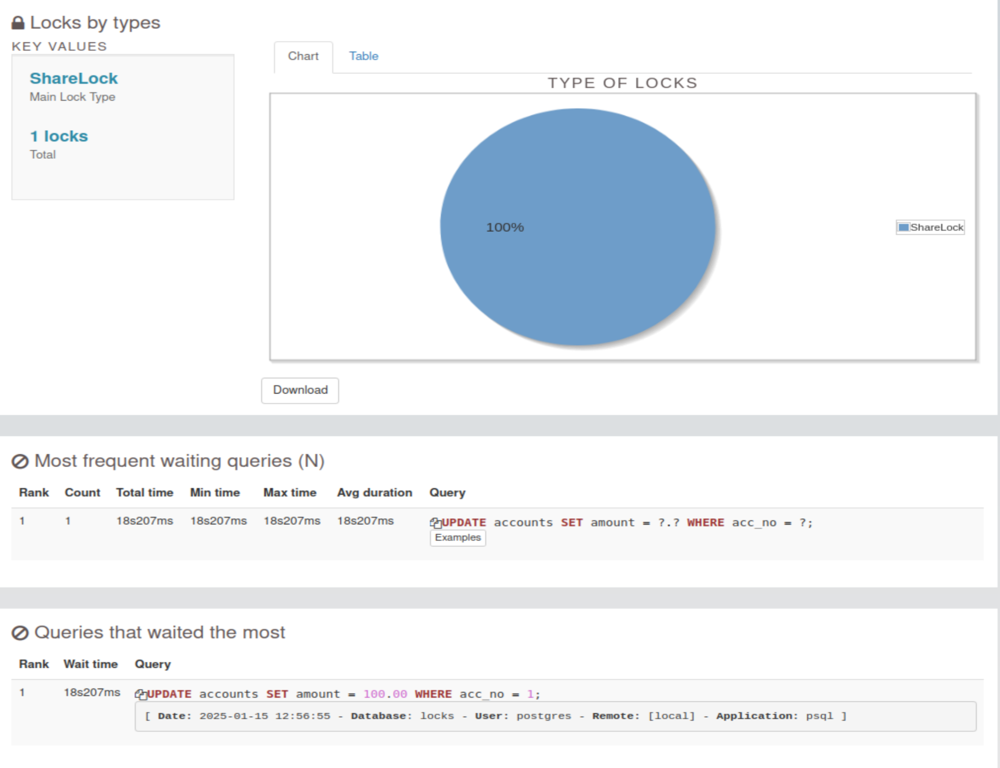
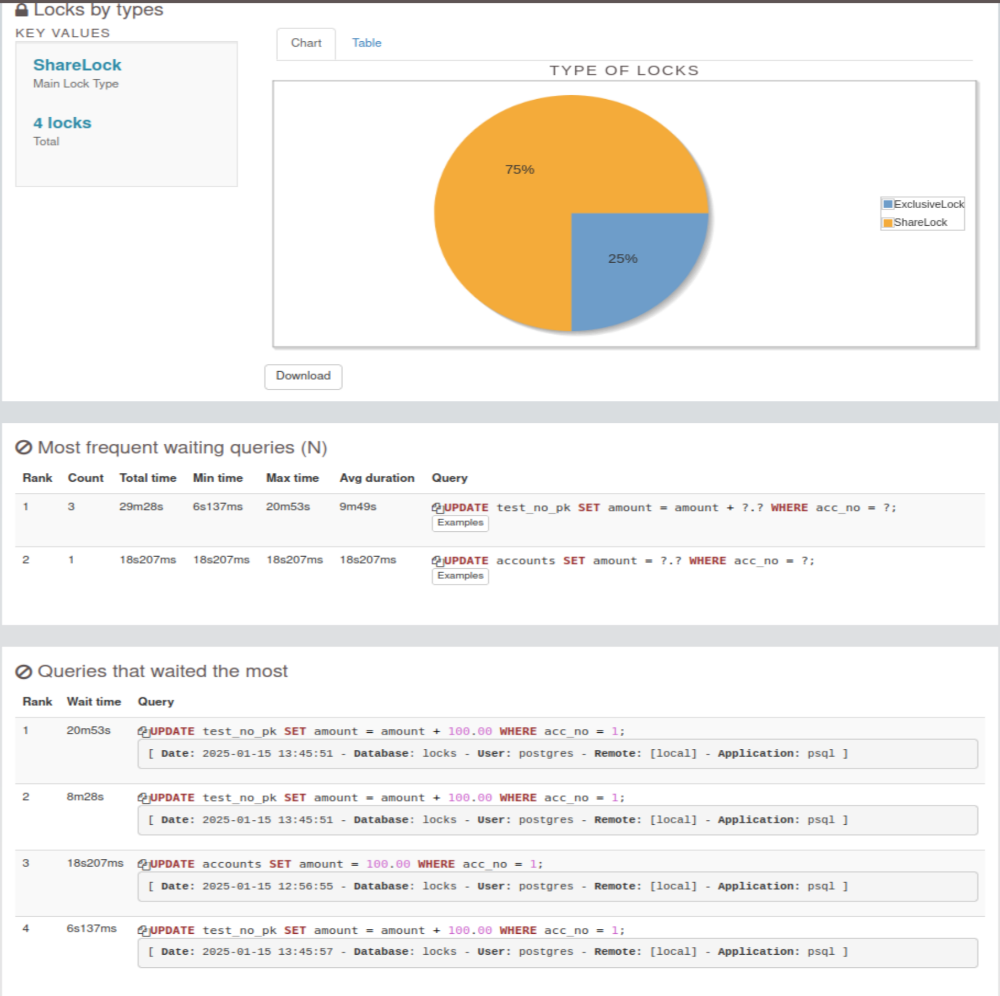
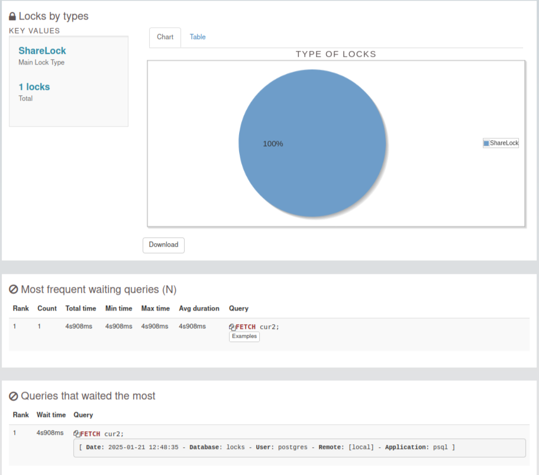

### Настройте сервер так, чтобы в журнал сообщений сбрасывалась информация о блокировках, удерживаемых более 200 миллисекунд.
#### Проверим, включено ли у нас логирование. 
#### Логирование включено
```sql
postgres=# show log_lock_waits ;
 log_lock_waits
----------------
 on
(1 row)

```
#### Посмотрим log_min_duration_statement. Управляет тем, какие SQL-операторы, завершившиеся ошибкой, записываются в журнал сервера. SQL-оператор будет записан в журнал, если он завершится ошибкой с указанным уровнем важности или выше. Допустимые значения: DEBUG5, DEBUG4, DEBUG3, DEBUG2, DEBUG1, INFO, NOTICE, WARNING, ERROR, LOG, FATAL и PANIC. По умолчанию используется ERROR. Это означает, что в журнал сервера будут записаны все операторы, завершившиеся сообщением с уровнем важности ERROR, LOG, FATAL и PANIC. Чтобы фактически отключить запись операторов с ошибками, установите для этого параметра значение PANIC. Изменить этот параметр могут только суперпользователи.
```sql
postgres=# show log_min_duration_statement ;
 log_min_duration_statement
----------------------------
 10s
(1 row)
```

#### Проверим, через какое время срабатывает освобождение от взаимоблокировок
#### Через 1 сек
```sql
locks=# show deadlock_timeout ;
 deadlock_timeout
------------------
 1s
(1 row)
```
```sql
postgres=# alter system set deadlock_timeout ='200ms';
ALTER SYSTEM
postgres=# select pg_reload_conf();
 pg_reload_conf
----------------
 t
(1 row)

postgres=#

```
#### воспроизведем блокировку
#### транзакция 1
```sql
postgres=# \c locks
You are now connected to database "locks" as user "postgres".
locks=# \dt
          List of relations
 Schema |   Name   | Type  |  Owner
--------+----------+-------+----------
 public | accounts | table | postgres
(1 row)

locks=# begin;
BEGIN
locks=# UPDATE accounts SET amount = 10.00 WHERE acc_no = 1;
UPDATE 1
locks=# SELECT pg_sleep(1);
 pg_sleep
----------

(1 row)

locks=#  COMMIT;
COMMIT
locks=#
```
#### транзакция 2
```sql
postgres=# \c locks
You are now connected to database "locks" as user "postgres".
locks=# begin;
BEGIN
locks=#  UPDATE accounts SET amount = 100.00 WHERE acc_no = 1;
UPDATE 1
locks=# COMMIT;
COMMIT
locks=#
```
#### посмотрим логи
```bash
postgres@Ubuntu:~$ tail -n 7  /var/lib/postgresql/12/main/log/postgresql-2025-01-15_114953.csv
2025-01-15 12:55:42.219 MSK,"postgres","locks",18264,"[local]",6787861e.4758,2,"authentication",2025-01-15 12:55:42 MSK,5/213,0,LOG,00000,"connection authorized: user=postgres database=locks application_name=psql",,,,,,,,,""
2025-01-15 12:55:42.221 MSK,"postgres","postgres",18260,"[local]",67878608.4754,3,"idle",2025-01-15 12:55:20 MSK,,0,LOG,00000,"disconnection: session time: 0:00:22.052 user=postgres database=postgres host=[local]",,,,,,,,,"psql"
2025-01-15 12:56:37.503 MSK,"postgres","locks",18264,"[local]",6787861e.4758,3,"UPDATE waiting",2025-01-15 12:55:42 MSK,5/214,6207431,LOG,00000,"process 18264 still waiting for ShareLock on transaction 6207430 after 203.945 ms","Process holding the lock: 18262. Wait queue: 18264.",,,,"while updating tuple (0,7) in relation ""accounts""","UPDATE accounts SET amount = 100.00 WHERE acc_no = 1;",,,"psql"
2025-01-15 12:56:55.507 MSK,"postgres","locks",18264,"[local]",6787861e.4758,4,"UPDATE waiting",2025-01-15 12:55:42 MSK,5/214,6207431,LOG,00000,"process 18264 acquired ShareLock on transaction 6207430 after 18207.615 ms",,,,,"while updating tuple (0,7) in relation ""accounts""","UPDATE accounts SET amount = 100.00 WHERE acc_no = 1;",,,"psql"
2025-01-15 12:56:55.507 MSK,"postgres","locks",18264,"[local]",6787861e.4758,5,"UPDATE",2025-01-15 12:55:42 MSK,5/214,6207431,LOG,00000,"duration: 18208.860 ms  statement: UPDATE accounts SET amount = 100.00 WHERE acc_no = 1;",,,,,,,,,"psql"
2025-01-15 12:59:58.632 MSK,,,1305,,678776b3.519,3,,2025-01-15 11:49:55 MSK,,0,LOG,00000,"checkpoint starting: time",,,,,,,,,""
2025-01-15 12:59:58.760 MSK,,,1305,,678776b3.519,4,,2025-01-15 11:49:55 MSK,,0,LOG,00000,"checkpoint complete: wrote 1 buffers (0.0%); 0 WAL file(s) added, 0 removed, 0 recycled; write=0.105 s, sync=0.004 s, total=0.129 s; sync files=1, longest=0.004 s, average=0.004 s; distance=1 kB, estimate=1 kB",,,,,,,,,""

```


### Смоделируйте ситуацию обновления одной и той же строки тремя командами UPDATE в разных сеансах. 
#### для этого создадим таблицу 
#### заполним ее данными
```sql
locks=# create table test_no_pk(acc_no integer, amount numeric);
CREATE TABLE
locks=# INSERT INTO test_no_pk VALUES (1,1000.00),(2,2000.00),(3,3000.00);
INSERT 0 3
```
#### для удобства создадим представление
```sql
locks=# CREATE VIEW locks AS
locks-# SELECT pid,
locks-#        locktype,
locks-#        CASE locktype
locks-#          WHEN 'relation' THEN relation::REGCLASS::text
locks-#          WHEN 'virtualxid' THEN virtualxid::text
locks-#          WHEN 'transactionid' THEN transactionid::text
locks-#          WHEN 'tuple' THEN relation::REGCLASS::text||':'||tuple::text
locks-#        END AS lockid,
locks-#        mode,
locks-#        granted
locks-# FROM pg_locks;
CREATE VIEW
```
#### итак, первая транзакция обновляет, и соответственно блокирует строку
```sql
locks=# begin;
BEGIN
locks=# select txid_current(), pg_backend_pid();
 txid_current | pg_backend_pid
--------------+----------------
      6207436 |          18262
(1 row)

locks=# UPDATE test_no_pk SET amount = amount + 100.00 WHERE acc_no = 1;
UPDATE 1

```
#### вторая транзакция делает то же самое
```sql
locks=# begin;
BEGIN
locks=# SELECT txid_current(), pg_backend_pid();
 txid_current | pg_backend_pid
--------------+----------------
      6207437 |          18264
(1 row)

locks=#  UPDATE test_no_pk SET amount = amount + 100.00 WHERE acc_no = 1;
```
#### И третья
```sql
locks=# begin;
BEGIN
locks=# SELECT txid_current(), pg_backend_pid();
 txid_current | pg_backend_pid
--------------+----------------
      6207438 |          19055
(1 row)

locks=# UPDATE test_no_pk SET amount = amount + 100.00 WHERE acc_no = 1;
```
####  Изучите возникшие блокировки в представлении pg_locks и убедитесь, что все они понятны. Пришлите список блокировок и объясните, что значит каждая.
#### Блокировки для первой транзакции:
```sql
locks=# select * from locks where pid=18262;
  pid  |   locktype    |              lockid               |       mode       | granted
-------+---------------+-----------------------------------+------------------+---------
 18262 | relation      | pg_locks                          | AccessShareLock  | t
 18262 | relation      | locks                             | AccessShareLock  | t
 18262 | relation      | test_no_pk                        | RowExclusiveLock | t
 18262 | relation      | pg_class_tblspc_relfilenode_index | AccessShareLock  | t
 18262 | relation      | pg_class_relname_nsp_index        | AccessShareLock  | t
 18262 | relation      | pg_class_oid_index                | AccessShareLock  | t
 18262 | relation      | pg_namespace_oid_index            | AccessShareLock  | t
 18262 | relation      | pg_namespace_nspname_index        | AccessShareLock  | t
 18262 | relation      | pg_namespace                      | AccessShareLock  | t
 18262 | relation      | pg_class                          | AccessShareLock  | t
 18262 | relation      | accounts_acc_no_idx1              | RowExclusiveLock | t
 18262 | relation      | accounts_acc_no_idx               | RowExclusiveLock | t
 18262 | relation      | accounts_pkey                     | RowExclusiveLock | t
 18262 | relation      | accounts                          | RowExclusiveLock | t
 18262 | virtualxid    | 7/22                              | ExclusiveLock    | t
 18262 | transactionid | 6207436                           | ExclusiveLock    | t
(16 rows)
```
* Тип relation для pg_locks locks pg_class pg_namespace в режиме AccessShareLock - установились на читаемые отношения
* Тип relation для test_no_pk в режиме RowExclusiveLock - установились на изменяемую таблицу
* Типы virtualxid transactionid в режиме ExclusiveLock - удерживаются каждой транзакцией для самой себя
#### Блокировки для второй транзакции
```sql
locks=# select * from locks where pid=18264;
  pid  |   locktype    |    lockid    |       mode       | granted
-------+---------------+--------------+------------------+---------
 18264 | relation      | test_no_pk   | RowExclusiveLock | t
 18264 | virtualxid    | 5/216        | ExclusiveLock    | t
 18264 | tuple         | test_no_pk:1 | ExclusiveLock    | t
 18264 | transactionid | 6207437      | ExclusiveLock    | t
 18264 | transactionid | 6207436      | ShareLock        | f
(5 rows)

```
* Блокировки AccessShareLock отсутствуют, т.к. мы не обращались запросами на чтение
* Транзакция ожидает получене блокировки типа transactionid в режиме ShareLock(granted=f) txid первой транзакции=6207436 здесь видно, что вторая транзакция не получила блокировку номера первой транзакции, т.к. первая транзакция еще длится
* Появилась блокировка типа tuple для обновляемой строки
#### Блокировки для третей транзакции
```sql
locks=# select * from locks where pid=19055;
  pid  |   locktype    |              lockid               |       mode       | granted
-------+---------------+-----------------------------------+------------------+---------
 19055 | relation      | test_no_pk                        | RowExclusiveLock | t
 19055 | relation      | pg_class_tblspc_relfilenode_index | AccessShareLock  | t
 19055 | relation      | pg_class_relname_nsp_index        | AccessShareLock  | t
 19055 | relation      | pg_class_oid_index                | AccessShareLock  | t
 19055 | relation      | pg_namespace_oid_index            | AccessShareLock  | t
 19055 | relation      | pg_namespace_nspname_index        | AccessShareLock  | t
 19055 | relation      | pg_namespace                      | AccessShareLock  | t
 19055 | relation      | pg_class                          | AccessShareLock  | t
 19055 | virtualxid    | 8/4                               | ExclusiveLock    | t
 19055 | tuple         | test_no_pk:1                      | ExclusiveLock    | f
 19055 | transactionid | 6207438                           | ExclusiveLock    | t
(11 rows)

```
* А вот третья транзакция уже увидела, что вторая транзакция попыталась получить блокировку номера первой транзакции, и у нее не получилось, а так же она видит что вторая транзакция получила блокировку типа tuple этой же строки, и поэтому она тоже берет блокировку типа tuple этой самой строки
#### общая картина
```sql
locks=# SELECT pid, wait_event_type, wait_event, pg_blocking_pids(pid)
locks-# FROM pg_stat_activity
locks-# WHERE backend_type = 'client backend';
  pid  | wait_event_type |  wait_event   | pg_blocking_pids
-------+-----------------+---------------+------------------
  1568 | Client          | ClientRead    | {}
  1569 | Client          | ClientRead    | {}
 18264 | Lock            | transactionid | {18262}
 18262 |                 |               | {}
 19055 | Lock            | tuple         | {18264}
(5 rows)
```
* Здесь видно, что транзакция с pid 18264 заблокирована транзакцией 18262 тип transactionid
* А транзакция с pid 19055 заблокирована транзакцией с pid 18264 тип tuple
```bash
postgres@Ubuntu:~$ tail -n 7  /var/lib/postgresql/12/main/log/postgresql-2025-01-15_114953.csv
2025-01-15 13:37:23.551 MSK,"postgres","locks",19055,"[local]",67878fbb.4a6f,3,"UPDATE waiting",2025-01-15 13:36:43 MSK,8/4,6207438,LOG,00000,"process 19055 still waiting for ExclusiveLock on tuple (0,1) of relation 189621 of database 173237 after 200.835 ms","Process holding the lock: 18264. Wait queue: 19055.",,,,,"UPDATE test_no_pk SET amount = amount + 100.00 WHERE acc_no = 1;",,,"psql"
2025-01-15 13:45:51.840 MSK,"postgres","locks",18264,"[local]",6787861e.4758,8,"UPDATE waiting",2025-01-15 12:55:42 MSK,5/216,6207437,LOG,00000,"process 18264 acquired ShareLock on transaction 6207436 after 1253993.651 ms",,,,,"while updating tuple (0,1) in relation ""test_no_pk""","UPDATE test_no_pk SET amount = amount + 100.00 WHERE acc_no = 1;",,,"psql"
2025-01-15 13:45:51.840 MSK,"postgres","locks",19055,"[local]",67878fbb.4a6f,4,"UPDATE waiting",2025-01-15 13:36:43 MSK,8/4,6207438,LOG,00000,"process 19055 acquired ExclusiveLock on tuple (0,1) of relation 189621 of database 173237 after 508489.910 ms",,,,,,"UPDATE test_no_pk SET amount = amount + 100.00 WHERE acc_no = 1;",,,"psql"
2025-01-15 13:45:51.840 MSK,"postgres","locks",18264,"[local]",6787861e.4758,9,"UPDATE",2025-01-15 12:55:42 MSK,5/216,6207437,LOG,00000,"duration: 1253994.120 ms  statement: UPDATE test_no_pk SET amount = amount + 100.00 WHERE acc_no = 1;",,,,,,,,,"psql"
2025-01-15 13:45:52.041 MSK,"postgres","locks",19055,"[local]",67878fbb.4a6f,5,"UPDATE waiting",2025-01-15 13:36:43 MSK,8/4,6207438,LOG,00000,"process 19055 still waiting for ShareLock on transaction 6207437 after 201.164 ms","Process holding the lock: 18264. Wait queue: 19055.",,,,"while rechecking updated tuple (0,4) in relation ""test_no_pk""","UPDATE test_no_pk SET amount = amount + 100.00 WHERE acc_no = 1;",,,"psql"
2025-01-15 13:45:57.978 MSK,"postgres","locks",19055,"[local]",67878fbb.4a6f,6,"UPDATE waiting",2025-01-15 13:36:43 MSK,8/4,6207438,LOG,00000,"process 19055 acquired ShareLock on transaction 6207437 after 6137.409 ms",,,,,"while rechecking updated tuple (0,4) in relation ""test_no_pk""","UPDATE test_no_pk SET amount = amount + 100.00 WHERE acc_no = 1;",,,"psql"
2025-01-15 13:45:57.978 MSK,"postgres","locks",19055,"[local]",67878fbb.4a6f,7,"UPDATE",2025-01-15 13:36:43 MSK,8/4,6207438,LOG,00000,"duration: 514627.989 ms  statement: UPDATE test_no_pk SET amount = amount + 100.00 WHERE acc_no = 1;",,,,,,,,,"psql"

```


#### Воспроизведите взаимоблокировку трех транзакций. 
```sql
Транзакция 1
 begin;
 update test_no_pk set amount =amount-100 where acc_no=1;
Транзакция 2
begin;
 update test_no_pk set amount =amount-100 where acc_no=2;
Транзакция 3
begin;
 update test_no_pk set amount =amount-100 where acc_no=3;

Транзакция 1
update test_no_pk set amount =amount+100 where acc_no=2;
Транзакция 2
update test_no_pk set amount =amount+100 where acc_no=3;
Транзакция 3
 UPDATE test_no_pk SET amount = amount + 100.00 WHERE acc_no = 1;
ERROR:  deadlock detected
DETAIL:  Process 4508 waits for ShareLock on transaction 6207443; blocked by process 4496.
Process 4496 waits for ShareLock on transaction 6207444; blocked by process 4506.
Process 4506 waits for ShareLock on transaction 6207445; blocked by process 4508.
HINT:  See server log for query details.
CONTEXT:  while updating tuple (0,7) in relation "test_no_pk"
```
####  Можно ли разобраться в ситуации постфактум, изучая журнал сообщений?
```bash
2025-01-20 09:41:51.713 MSK,"postgres","locks",4496,"[local]",678dec59.1190,5,"UPDATE waiting",2025-01-20 09:25:29 MSK,9/10,6207443,LOG,00000,"process 4496 still waiting for ShareLock on transaction 6207444 after 223.755 ms","Process holding the lock: 4506. Wait queue: 4496.",,,,"while updating tuple (0,9) in relation ""test_no_pk""","update test_no_pk set amount =amount+100 where acc_no=2;",,,"psql"
2025-01-20 09:42:10.737 MSK,"postgres","locks",4506,"[local]",678dec5e.119a,3,"UPDATE waiting",2025-01-20 09:25:34 MSK,6/18,6207444,LOG,00000,"process 4506 still waiting for ShareLock on transaction 6207445 after 207.368 ms","Process holding the lock: 4508. Wait queue: 4506.",,,,"while updating tuple (0,10) in relation ""test_no_pk""","update test_no_pk set amount =amount+100 where acc_no=3;",,,"psql"
2025-01-20 09:42:20.796 MSK,"postgres","locks",4508,"[local]",678dec5f.119c,4,"UPDATE waiting",2025-01-20 09:25:35 MSK,5/28,6207445,LOG,00000,"process 4508 detected deadlock while waiting for ShareLock on transaction 6207443 after 205.386 ms","Process holding the lock: 4496. Wait queue: .",,,,"while updating tuple (0,7) in relation ""test_no_pk""","UPDATE test_no_pk SET amount = amount + 100.00 WHERE acc_no = 1;",,,"psql"
2025-01-20 09:42:20.796 MSK,"postgres","locks",4508,"[local]",678dec5f.119c,5,"UPDATE",2025-01-20 09:25:35 MSK,5/28,6207445,ERROR,40P01,"deadlock detected","Process 4508 waits for ShareLock on transaction 6207443; blocked by process 4496.
Process 4496 waits for ShareLock on transaction 6207444; blocked by process 4506.
Process 4506 waits for ShareLock on transaction 6207445; blocked by process 4508.
Process 4508: UPDATE test_no_pk SET amount = amount + 100.00 WHERE acc_no = 1;
Process 4496: update test_no_pk set amount =amount+100 where acc_no=2;
Process 4506: update test_no_pk set amount =amount+100 where acc_no=3;","See server log for query details.",,,"while updating tuple (0,7) in relation ""test_no_pk""","UPDATE test_no_pk SET amount = amount + 100.00 WHERE acc_no = 1;",,,"psql"
2025-01-20 09:42:20.796 MSK,"postgres","locks",4506,"[local]",678dec5e.119a,4,"UPDATE waiting",2025-01-20 09:25:34 MSK,6/18,6207444,LOG,00000,"process 4506 acquired ShareLock on transaction 6207445 after 10266.330 ms",,,,,"while updating tuple (0,10) in relation ""test_no_pk""","update test_no_pk set amount =amount+100 where acc_no=3;",,,"psql"
2025-01-20 09:42:20.796 MSK,"postgres","locks",4506,"[local]",678dec5e.119a,5,"UPDATE",2025-01-20 09:25:34 MSK,6/18,6207444,LOG,00000,"duration: 10266.896 ms  statement: update test_no_pk set amount =amount+100 where acc_no=3;",,,,,,,,,"psql"
2025-01-20 09:45:03.919 MSK,,,1311,,678de9e5.51f,5,,2025-01-20 09:15:01 MSK,,0,LOG,00000,"checkpoint starting: time",,,,,,,,,""
2025-01-20 09:45:04.058 MSK,,,1311,,678de9e5.51f,6,,2025-01-20 09:15:01 MSK,,0,LOG,00000,"checkpoint complete: wrote 1 buffers (0.0%); 0 WAL file(s) added, 0 removed, 0 recycled; write=0.109 s, sync=0.004 s, total=0.139 s; sync files=1, longest=0.004 s, average=0.004 s; distance=1 kB, estimate=1 kB",,,,,,,,,""
2025-01-20 09:49:02.749 MSK,"postgres","locks",4496,"[local]",678dec59.1190,6,"UPDATE waiting",2025-01-20 09:25:29 MSK,9/10,6207443,LOG,00000,"process 4496 acquired ShareLock on transaction 6207444 after 431259.200 ms",,,,,"while updating tuple (0,9) in relation ""test_no_pk""","update test_no_pk set amount =amount+100 where acc_no=2;",,,"psql"
2025-01-20 09:49:02.749 MSK,"postgres","locks",4496,"[local]",678dec59.1190,7,"UPDATE",2025-01-20 09:25:29 MSK,9/10,6207443,LOG,00000,"duration: 431259.656 ms  statement: update test_no_pk set amount =amount+100 where acc_no=2;",,,,,,,,,"psql"
2025-01-20 09:49:10.177 MSK,"postgres","locks",4507,"[local]",678dec5f.119b,3,"COMMIT",2025-01-20 09:25:35 MSK,7/6,0,WARNING,25P01,"there is no transaction in progress",,,,,,,,,"psql"
2025-01-20 09:50:03.119 MSK,,,1311,,678de9e5.51f,7,,2025-01-20 09:15:01 MSK,,0,LOG,00000,"checkpoint starting: time",,,,,,,,,""
2025-01-20 09:50:03.268 MSK,,,1311,,678de9e5.51f,8,,2025-01-20 09:15:01 MSK,,0,LOG,00000,"checkpoint complete: wrote 1 buffers (0.0%); 0 WAL file(s) added, 0 removed, 0 recycled; write=0.113 s, sync=0.004 s, total=0.149 s; sync files=1, longest=0.004 s, average=0.004 s; distance=1 kB, estimate=1 kB",,,,,,,,,""
2025-01-20 12:19:29.917 MSK,"postgres","locks",4496,"[local]",678dec59.1190,8,"idle in transaction",2025-01-20 09:25:29 MSK,9/10,6207443,LOG,08006,"unexpected EOF on client connection with an open transaction",,,,,,,,,"psql"
2025-01-20 12:19:29.917 MSK,"postgres","locks",4496,"[local]",678dec59.1190,9,"idle in transaction",2025-01-20 09:25:29 MSK,,0,LOG,00000,"disconnection: session time: 2:54:00.381 user=postgres database=locks host=[local]",,,,,,,,,"psql"
2025-01-20 12:19:29.918 MSK,"postgres","locks",4508,"[local]",678dec5f.119c,6,"idle",2025-01-20 09:25:35 MSK,,0,LOG,00000,"disconnection: session time: 2:53:54.148 user=postgres database=locks host=[local]",,,,,,,,,"psql"
2025-01-20 12:19:29.930 MSK,"postgres","locks",4507,"[local]",678dec5f.119b,4,"idle",2025-01-20 09:25:35 MSK,,0,LOG,00000,"disconnection: session time: 2:53:54.713 user=postgres database=locks host=[local]",,,,,,,,,"psql"
2025-01-20 12:19:29.931 MSK,"postgres","locks",4506,"[local]",678dec5e.119a,6,"idle",2025-01-20 09:25:34 MSK,,0,LOG,00000,"disconnection: session time: 2:53:55.671 user=postgres database=locks host=[local]",,,,,,,,,"psql"
2025-01-20 12:23:34.521 MSK,,,1311,,678de9e5.51f,9,,2025-01-20 09:15:01 MSK,,0,LOG,00000,"checkpoint starting: time",,,,,,,,,""
2025-01-20 12:23:34.559 MSK,,,1311,,678de9e5.51f,10,,2025-01-20 09:15:01 MSK,,0,LOG,00000,"checkpoint complete: wrote 0 buffers (0.0%); 0 WAL file(s) added, 0 removed, 0 recycled; write=0.011 s, sync=0.001 s, total=0.039 s; sync files=0, longest=0.000 s, average=0.000 s; distance=0 kB, estimate=1 kB",,,,,,,,,""
```
#### да, можно. мы нашли в логах deadlock detected
```bash
postgres@Ubuntu:~$ grep 'deadlock detected'  /var/lib/postgresql/12/main/log/postgresql-2025-01-20_091459.csv
2025-01-20 09:42:20.796 MSK,"postgres","locks",4508,"[local]",678dec5f.119c,5,"UPDATE",2025-01-20 09:25:35 MSK,5/28,6207445,ERROR,40P01,"deadlock detected","Process 4508 waits for ShareLock on transaction 6207443; blocked by process 4496.
```
#### Могут ли две транзакции, выполняющие единственную команду UPDATE одной и той же таблицы (без where), заблокировать друг друга?
#### Команда UPDATE блокирует строки по мере их обновления. Это происходит не одномоментно. Поэтому если одна команда будет обновлять строки в одном порядке, а другая - в другом, они могут взаимозаблокироваться.Это может произойти, если для команд будут построены разные планы выполнения, например, одна будет читать таблицу последовательно, а другая - по индексу. Получить такую ситуацию непросто даже специально, в реальной работе она маловероятна. Проиллюстрировать ее проще всего с помощью курсоров, поскольку это дает возможность управлять порядком чтения.
```sql
Здесь работают сразу две транзакции.
Это первая
postgres=# \c locks 
You are now connected to database "locks" as user "postgres".
locks=# 
locks=# begin;
BEGIN
locks=# declare cur1 cursor for select * from test_no_pk order by acc_no for update;
DECLARE CURSOR
locks=# fetch cur1;
 acc_no | amount  
--------+---------
      1 | 1100.00
(1 row)

locks=# fetch cur1;
 acc_no | amount  
--------+---------
      2 | 1800.00
(1 row)

locks=# fetch cur1;
ERROR:  deadlock detected
DETAIL:  Process 26900 waits for ShareLock on transaction 6207447; blocked by process 26901.
Process 26901 waits for ShareLock on transaction 6207446; blocked by process 26900.
HINT:  See server log for query details.
CONTEXT:  while locking tuple (0,14) in relation "test_no_pk"
locks=# 

Это вторая
postgres=# \c locks 
You are now connected to database "locks" as user "postgres".
locks=# 
locks=# begin;
BEGIN
locks=# declare cur2 cursor for select * from test_no_pk order by acc_no DESC for update;
DECLARE CURSOR
locks=# fetch cur2;
 acc_no | amount  
--------+---------
      3 | 3000.00
(1 row)

locks=# fetch cur2;
 acc_no | amount  
--------+---------
      2 | 1800.00
(1 row)
```


```bash
2025-01-21 12:43:37.481 MSK,"postgres","postgres",26898,"[local]",678f6c49.6912,2,"authentication",2025-01-21 12:43:37 MSK,6/1,0,LOG,00000,"connection authorized: user=postgres database=postgres application_name=psql",,,,,,,,,""
2025-01-21 12:43:43.530 MSK,,,26900,"[local]",678f6c4f.6914,1,"",2025-01-21 12:43:43 MSK,,0,LOG,00000,"connection received: host=[local]",,,,,,,,,""
2025-01-21 12:43:43.530 MSK,"postgres","locks",26900,"[local]",678f6c4f.6914,2,"authentication",2025-01-21 12:43:43 MSK,7/1,0,LOG,00000,"connection authorized: user=postgres database=locks application_name=psql",,,,,,,,,""
2025-01-21 12:43:43.545 MSK,"postgres","postgres",26898,"[local]",678f6c49.6912,3,"idle",2025-01-21 12:43:37 MSK,,0,LOG,00000,"disconnection: session time: 0:00:06.065 user=postgres database=postgres host=[local]",,,,,,,,,"psql"
2025-01-21 12:43:50.140 MSK,,,26901,"[local]",678f6c56.6915,1,"",2025-01-21 12:43:50 MSK,,0,LOG,00000,"connection received: host=[local]",,,,,,,,,""
2025-01-21 12:43:50.140 MSK,"postgres","locks",26901,"[local]",678f6c56.6915,2,"authentication",2025-01-21 12:43:50 MSK,6/3,0,LOG,00000,"connection authorized: user=postgres database=locks application_name=psql",,,,,,,,,""
2025-01-21 12:43:50.142 MSK,"postgres","postgres",26882,"[local]",678f6c41.6902,3,"idle",2025-01-21 12:43:29 MSK,,0,LOG,00000,"disconnection: session time: 0:00:20.471 user=postgres database=postgres host=[local]",,,,,,,,,"psql"
2025-01-21 12:48:30.449 MSK,"postgres","locks",26901,"[local]",678f6c56.6915,3,"FETCH waiting",2025-01-21 12:43:50 MSK,6/4,6207447,LOG,00000,"process 26901 still waiting for ShareLock on transaction 6207446 after 200.939 ms","Process holding the lock: 26900. Wait queue: 26901.",,,,"while locking tuple (0,12) in relation ""test_no_pk""","fetch cur2;",,,"psql"
```
*** 2025-01-21 12:48:35.156 MSK,"postgres","locks",26900,"[local]",678f6c4f.6914,3,"FETCH waiting",2025-01-21 12:43:43 MSK,7/2,6207446,LOG,00000,"process 26900 detected deadlock while waiting for ShareLock on transaction 6207447 after 200.180 ms","Process holding the lock: 26901. Wait queue: .",,,,"while locking tuple (0,14) in relation ""test_no_pk""","fetch cur1;",,,"psql" ***
```bash
2025-01-21 12:48:35.156 MSK,"postgres","locks",26900,"[local]",678f6c4f.6914,4,"FETCH",2025-01-21 12:43:43 MSK,7/2,6207446,ERROR,40P01,"deadlock detected","Process 26900 waits for ShareLock on transaction 6207447; blocked by process 26901.
Process 26901 waits for ShareLock on transaction 6207446; blocked by process 26900.
Process 26900: fetch cur1;
Process 26901: fetch cur2;","See server log for query details.",,,"while locking tuple (0,14) in relation ""test_no_pk""","fetch cur1;",,,"psql"
2025-01-21 12:48:35.156 MSK,"postgres","locks",26901,"[local]",678f6c56.6915,4,"FETCH waiting",2025-01-21 12:43:50 MSK,6/4,6207447,LOG,00000,"process 26901 acquired ShareLock on transaction 6207446 after 4908.415 ms",,,,,"while locking tuple (0,12) in relation ""test_no_pk""","fetch cur2;",,,"psql"
2025-01-21 12:51:55.702 MSK,,,1277,,678f5efe.4fd,1,,2025-01-21 11:46:54 MSK,,0,LOG,00000,"checkpoint starting: time",,,,,,,,,""
2025-01-21 12:51:55.840 MSK,,,1277,,678f5efe.4fd,2,,2025-01-21 11:46:54 MSK,,0,LOG,00000,"checkpoint complete: wrote 1 buffers (0.0%); 0 WAL file(s) added, 0 removed, 0 recycled; write=0.108 s, sync=0.004 s, total=0.139 s; sync files=1, longest=0.004 s, average=0.004 s; distance=1 kB, estimate=1 kB",,,,,,,,,""

'''


